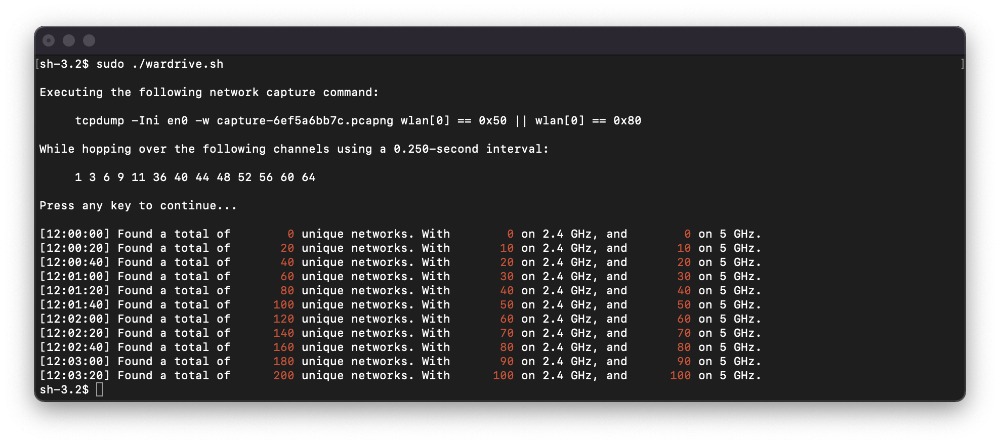

# Wi-Fi Wardriving for macOS

Are you trying to wardrive on macOS? Are you tired of virtual machines, unreliable dongles and adapters, batteries which discharge instantaneously, overcomplicated tooling and configurations? Then look no further.

This tool uses your built-in wireless network card and utilities to dump beacon and probe response frames.

Furthermore, it implements easy-to-configure channel hopping, and displays unique network counts as-you-go.

This tool is robust and awesome, because it is simple.

<p align="center">
	
	<br />
	<em>Example output of the wardriving tool built for macOS-systems.</em>
</p>

## Tool

This tool was tested on macOS Monterey (Version 12.1) and macOS Ventura (Version 13.3).

#### Pre-Requirements

The only pre-requirements are ```tcpdump``` and ```tshark``` which can be installed as part of Wireshark: 
```
brew install wireshark
```

If you have not used the built-in ```airport``` utility before then you might need to create a symbolic link:
```
sudo ln -s /System/Library/PrivateFrameworks/Apple80211.framework/Versions/Current/Resources/airport /usr/local/bin/airport
```

#### Usage

Using the tool is simple, and requires administrative privileges for the built-in ```airport``` utility:
```
sudo ./wardrive.sh
```

Typically you may reconfigure the channel list for your specific needs (for example, due to regulatory constraints).

In order to use all supported channels, or specify a specific list of channels, you can modify the ```chanlist``` list.

## Wi-Fi Surveying

Please refer to the [Wi-Fi Surveying](https://github.com/domienschepers/wifi-surveying) repository for:
- an overview of best practices in wardriving,
- [tools to anonymize datasets](https://github.com/domienschepers/wifi-surveying/tree/master/datasets), and
- [tools to extract security statistics](https://github.com/domienschepers/wifi-surveying/tree/master/tool).
